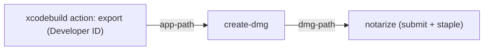

# create-dmg

A GitHub Action that packages an exported Developer ID `.app` into a signed DMG ready for notarization. It's the packaging step in the standard macOS direct-distribution pipeline and composes with the rest of the Apple-Actions suite:

- [`Apple-Actions/import-codesign-certs`](https://github.com/Apple-Actions/import-codesign-certs)
- [`Apple-Actions/download-provisioning-profiles`](https://github.com/Apple-Actions/download-provisioning-profiles)
- [`Apple-Actions/xcodebuild`](https://github.com/Apple-Actions/xcodebuild)
- [`Apple-Actions/notarize`](https://github.com/Apple-Actions/notarize)



Xcode has no DMG export, and Apple recommends notarizing the outermost container you distribute, so every Developer ID app shipped as a DMG needs this step. This action does **not** notarize; pass its `dmg-path` output to [`Apple-Actions/notarize`](https://github.com/Apple-Actions/notarize).

The action:

1. Checks the app before you spend a notarization round trip on it. It must exist, pass `codesign --verify --deep --strict`, and be signed with a `Developer ID Application` certificate, the hardened runtime, and a secure timestamp. If `team-id` is set, the app's team must match it.
2. Picks the signing identity. When several identities share a name, as happens after a certificate renewal, it picks the one whose certificate expires last.
3. Copies the app into a fresh staging directory with `ditto`, which keeps framework symlinks, extended attributes, and the signature intact. It also adds an `Applications -> /Applications` symlink.
4. Creates the image with `hdiutil create`, retrying when hosted runners report `Resource busy`.
5. Signs the DMG with `codesign --sign <hash> --timestamp`, retrying when Apple's timestamp service is unavailable, and verifies it with `codesign --verify --strict`.

## Usage

```yaml
- name: Create DMG
  id: dmg
  uses: Apple-Actions/create-dmg@v1
  with:
    app-path: ${{ steps.developer-id.outputs.app-path }}
```

### Full pipeline

Archive once, export with a `developer-id` `ExportOptions.plist`, package, notarize, and upload:

```yaml
jobs:
  release:
    runs-on: macos-26
    steps:
      - uses: actions/checkout@v7

      - name: Import signing certificates
        uses: Apple-Actions/import-codesign-certs@v7
        with:
          p12-file-base64: ${{ secrets.DEVELOPER_ID_P12_BASE64 }}
          p12-password: ${{ secrets.DEVELOPER_ID_P12_PASSWORD }}

      - name: Download provisioning profiles
        uses: Apple-Actions/download-provisioning-profiles@v7
        with:
          bundle-id: com.example.App
          profile-type: MAC_APP_DIRECT
          issuer-id: ${{ vars.APPSTORE_ISSUER_ID }}
          api-key-id: ${{ vars.APPSTORE_API_KEY_ID }}
          api-private-key: ${{ secrets.APPSTORE_API_PRIVATE_KEY }}

      - name: Archive
        uses: Apple-Actions/xcodebuild@v1
        with:
          project: App.xcodeproj
          scheme: App
          action: archive
          archive-path: .build/Artifacts/App.xcarchive
          build-number: ${{ github.run_number }}

      - name: Export (Developer ID)
        id: developer-id
        uses: Apple-Actions/xcodebuild@v1
        with:
          scheme: App
          action: export
          archive-path: .build/Artifacts/App.xcarchive
          export-options-plist: ExportOptions-DeveloperID.plist # method: developer-id
          export-path: .build/Artifacts/developer-id

      - name: Create DMG
        id: dmg
        uses: Apple-Actions/create-dmg@v1
        with:
          app-path: ${{ steps.developer-id.outputs.app-path }}

      - name: Notarize DMG
        uses: Apple-Actions/notarize@v1
        with:
          path: ${{ steps.dmg.outputs.dmg-path }}
          issuer-id: ${{ vars.APPSTORE_ISSUER_ID }}
          api-key-id: ${{ vars.APPSTORE_API_KEY_ID }}
          api-private-key: ${{ secrets.APPSTORE_API_PRIVATE_KEY }}

      - uses: actions/upload-artifact@v7
        with:
          name: dmg
          path: ${{ steps.dmg.outputs.dmg-path }}
```

## Inputs

| Name | Description | Default |
| --- | --- | --- |
| `app-path` | Path to the exported `.app` (for example the `xcodebuild` action's `app-path` output). **Required.** | — |
| `dmg-path` | Output path. Parent directories are created. | `<app name>.dmg` next to the `.app` |
| `volume-name` | Volume name shown in Finder. | The app's `CFBundleName`, or the `.app` file name |
| `signing-identity` | SHA-1 hash or full name of the identity that signs the DMG. | Newest valid `Developer ID Application` identity for `team-id` |
| `team-id` | Team ID used to select the identity and to check the app's signature. | The app's `TeamIdentifier` |
| `keychain` | Keychain to search for the identity. | The user keychain search list |
| `applications-link` | Add an `/Applications` symlink so users can drag to install. | `true` |
| `format` | `hdiutil` image format: `UDZO`, `ULFO`, `ULMO`, or `UDBZ`. | `UDZO` |

## Outputs

| Name | Description |
| --- | --- |
| `dmg-path` | Absolute path of the signed DMG. |
| `signing-identity` | SHA-1 hash of the identity that signed the DMG. |

## Requirements

- A macOS runner (for example `runs-on: macos-26`).
- An app exported with the `developer-id` method, so that it's signed with Developer ID Application, a secure timestamp, and the hardened runtime.
- The Developer ID Application certificate and its private key in a keychain on the runner, for example imported with [`Apple-Actions/import-codesign-certs`](https://github.com/Apple-Actions/import-codesign-certs).

## Identity selection

If `signing-identity` is a 40-character SHA-1 hash, it's used as-is. Otherwise the action lists valid code signing identities with `security find-identity -v -p codesigning` and keeps one of two sets:

- the identities named exactly `signing-identity`, if it's set
- otherwise, those named `Developer ID Application: ... (<team-id>)`

When more than one identity matches, the action reads each certificate with `security find-certificate -a -c <name> -Z -p` and picks the one with the latest expiry (`notAfter`). It logs which one it picked and why.

A renewed Developer ID certificate keeps the same name as the one it replaces. While both are in the keychain, signing by name is ambiguous, and `codesign` fails or picks one arbitrarily. That's why the action always signs by hash.

## Troubleshooting

- **"... is not signed with Developer ID"**: the app came from an App Store (`app-store-connect`) or development export. Export it again with an `ExportOptions.plist` whose `method` is `developer-id`. Notarization would reject the app anyway.
- **"No valid code signing identity matches ..."**: the imported `.p12` doesn't include a Developer ID Application certificate and private key. Only the Account Holder can create that certificate; the App Store Connect API returns 403 for other keys. The error message lists the identities that were found.
- **"... is not signed with the hardened runtime"** or **"... has no secure timestamp"**: notarization would reject the app. Enable Hardened Runtime for the target (`ENABLE_HARDENED_RUNTIME = YES`) and export with the `developer-id` method, which signs with a timestamp.
- **`hdiutil: create failed - Resource busy`**: hosted runners sometimes report this transiently, usually because XProtect or Spotlight is touching the new image. The action retries automatically, up to 5 attempts.
- **"The timestamp service is not available"**: Apple's timestamp server is occasionally unreachable. The action retries signing the DMG up to 3 times before failing.

## Caveats

- This action doesn't notarize or staple. Use [`Apple-Actions/notarize`](https://github.com/Apple-Actions/notarize) on `dmg-path`.
- There's no support for background images, window layout, volume icons, or license agreements.

## Development

```sh
yarn install
yarn all     # format, knip, lint, type-check, test, and bundle dist/index.js with esbuild
```

The bundled `dist/` directory is committed so the action can be consumed without a build step, matching the Apple-Actions convention. The `e2e` workflow runs the action on `macos-26` against a test app. It signs with two self-signed certificates that share a Developer ID name, to check that the later-expiring one is picked.

## License

MIT
