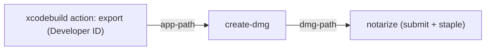

# Task: create `Apple-Actions/create-dmg`

Create a new GitHub Action, `Apple-Actions/create-dmg`. It takes an exported
Developer ID `.app` and produces a signed DMG ready for
`Apple-Actions/notarize`. It's the packaging step in the standard macOS
direct-distribution pipeline, with one action per Apple tool:



Xcode has no DMG export, and notarization needs a container (Apple
recommends notarizing the outermost thing you distribute), so every
Developer ID app shipped as a DMG needs this step. Today each repo writes it
by hand:

```bash
mkdir -p "$staging"
cp -R "$APP_PATH" "$staging/"
ln -s /Applications "$staging/Applications"
hdiutil create -format UDZO -volname "App" -srcfolder "$staging" -ov "$dmg"
identity=$(security find-identity -v -p codesigning | awk '/"Developer ID Application: .*\(TEAMID\)"/ { print $2; exit }')
codesign --sign "$identity" --timestamp "$dmg"
```

The action replaces that script and handles the details the script gets
wrong or skips: identity ambiguity after certificate renewal, `cp -R` vs
`ditto`, `hdiutil` flakiness on hosted runners, and checking the app before
spending a notarization round trip on it.

## Match the sibling repos

Clone `Apple-Actions/notarize`, `Apple-Actions/xcodebuild`, and
`Apple-Actions/download-provisioning-profiles`, and copy their conventions
exactly: language (TypeScript), Node runtime in `action.yml`, `dist/`
bundling and the `check-dist` workflow, lint/format/dead-code tooling,
test framework, README layout, `LICENSE`, Dependabot config, and release
tagging (`v1.0.0` plus a moving `v1`). Use `@actions/core` and
`@actions/exec`. Don't add other runtime dependencies unless the siblings
already use them.

## `action.yml`

```yaml
name: Create DMG
description: Package a macOS .app into a signed DMG for notarization
branding:
  icon: package
  color: blue
inputs:
  app-path:
    description: Path to the exported .app (for example the xcodebuild action's app-path output)
    required: true
  dmg-path:
    description: Output path. Defaults to <app name>.dmg next to the .app
    required: false
  volume-name:
    description: Volume name shown in Finder. Defaults to the app's CFBundleName (falls back to the .app file name)
    required: false
  signing-identity:
    description: SHA-1 hash or full name of the identity that signs the DMG. Defaults to the newest valid "Developer ID Application" identity, filtered by team-id
    required: false
  team-id:
    description: Team ID used to select the identity and to check the app's signature. Defaults to the app's TeamIdentifier
    required: false
  keychain:
    description: Keychain to search for the identity. Defaults to the user search list
    required: false
  applications-link:
    description: Add an /Applications symlink so users can drag to install
    required: false
    default: 'true'
  format:
    description: hdiutil image format (UDZO, ULFO, ULMO, UDBZ)
    required: false
    default: UDZO
outputs:
  dmg-path:
    description: Absolute path of the signed DMG
  signing-identity:
    description: SHA-1 hash of the identity that signed the DMG
runs:
  using: <same as siblings>
  main: dist/index.js
```

## Behavior, in order

1. **Validate the app.**
   - `app-path` must exist and end in `.app`. Fail with the path in the
     message otherwise. Not on macOS: fail with a clear message.
   - `codesign --verify --deep --strict` on the app. On failure, include
     codesign's output.
   - Read the signature with `codesign -dvv`. Fail if the leaf Authority
     isn't `Developer ID Application: ...`, saying that notarization will
     reject the app and that it should come from a `developer-id` export.
   - Read `TeamIdentifier`. If `team-id` is set and differs, fail.
2. **Pick the signing identity.**
   - If `signing-identity` is a 40-hex SHA-1, use it as-is.
   - Otherwise list identities with `security find-identity -v -p codesigning [keychain]`
     and keep those whose name is `signing-identity` (if set), or starts
     with `Developer ID Application:` and ends with `(<team-id>)`.
   - **None:** fail, listing the identities that were found, and point to
     `Apple-Actions/import-codesign-certs`.
   - **Several (a renewed certificate keeps the same name):** pick the one
     whose certificate has the latest `notAfter`. Get the certificates with
     `security find-certificate -a -c "<name>" -Z -p [keychain]`, match them
     by SHA-1, and parse them with Node's `crypto.X509Certificate`. Log
     which one was picked and why.
   - Always sign with the hash, never the name. A name is ambiguous while two
     identities share it.
3. **Stage.**
   - Make a fresh staging directory under `RUNNER_TEMP`.
   - Copy the app with `ditto`, not `cp -R`, so framework symlinks,
     extended attributes, and the signature survive.
   - If `applications-link` is true, add an `Applications -> /Applications`
     symlink.
4. **Create the image.**
   - `hdiutil create -format <format> -volname <name> -srcfolder <staging> -ov <dmg-path>`,
     creating the parent directory of `dmg-path` first.
   - Hosted runners sometimes fail with `Resource busy` (hdiutil exit 16).
     Retry up to 3 attempts with a short backoff, only on that failure,
     logging each retry.
5. **Sign and verify.**
   - `codesign --sign <hash> --timestamp <dmg>`, then `codesign --verify --strict <dmg>`.
   - Without `--timestamp`, notarization fails, so it's not optional.
6. **Outputs.** Set `dmg-path` (absolute) and `signing-identity`, and remove
   the staging directory.

Leave out background images, window layout, icons, license agreements, and
notarization; those belong to `notarize` or a later version. Keep the README
clear that this action doesn't notarize.

## README

- **What it does and where it fits:** the diagram above, and a full example
  that chains `import-codesign-certs` → `download-provisioning-profiles` →
  `xcodebuild` (archive) → `xcodebuild` (`action: export` with a
  `developer-id` plist) → `create-dmg` → `notarize` → `upload-artifact`.
  Use the real output names (`app-path`, `dmg-path`) and the current major
  tags.
- **Inputs and outputs:** a table.
- **Identity selection:** how the newest valid Developer ID identity is
  chosen, and why the action signs by hash.
- **Troubleshooting:**
  - "not signed with Developer ID": the app came from the App Store export;
    use the `developer-id` export.
  - No identity: the `.p12` doesn't include Developer ID Application. Only
    the Account Holder can create that certificate; the App Store Connect API
    returns 403 for other keys.
  - `Resource busy`: retried automatically.

## Tests

Follow the siblings' test setup, and add an end-to-end workflow on
`macos-latest` that runs the action from the repo (`uses: ./`) against a
real app:

- **Build a test app** with `xcodebuild` from a tiny fixture project in the
  repo, or assemble a minimal bundle (`Contents/Info.plist` plus a compiled
  `Contents/MacOS` binary from `swiftc`), and sign it.
- **Signing without Apple certificates:** the action's repo doesn't have
  Developer ID certificates. In a temporary keychain, create two self-signed
  code-signing certificates with the same common name,
  `Developer ID Application: Test (ABCDE12345)`, and different `notAfter`
  dates (use `openssl`). Mark them trusted for code signing in that keychain
  so `find-identity -v` lists them, and sign the app with one of them. If
  trust can't be set without a prompt on hosted runners, say so in the PR and
  test identity selection against real `security` output captured into
  fixtures instead.
- **Assertions,** with values that can fail:
  - `signing-identity` equals the SHA-1 of the later-expiring certificate,
    not the other one.
  - `codesign -dvv` on the DMG shows that hash's certificate and a
    `Timestamp=` line.
  - Mounting the DMG (`hdiutil attach -nobrowse -readonly`) shows the app
    and an `Applications` symlink to `/Applications`. With
    `applications-link: false`, a second case has no symlink.
  - The volume name equals the app's `CFBundleName`, or the custom
    `volume-name` in another case.
  - An app signed ad-hoc (`codesign -s -`) fails with the
    "not signed with Developer ID" message.

Notarization itself is out of scope here. `Apple-Actions/Example-macOS`
covers the full, notarized run with real certificates.

## After release

- Tag `v1.0.0` and move `v1`.
- Open PRs replacing the inline "Package DMG" step in:
  - `Apple-Actions/Example-macOS` (if it exists by then),
  - `awresports/scoreboard_ndi-macos` `.github/workflows/build_macos.yml`,
    through `awresports/standards`, since that workflow is generated.
- In `Apple-Actions/notarize`'s README, link to this action as the way to
  produce the DMG.

## Done when

- The action's CI (lint, tests, `check-dist`, end-to-end workflow) is
  green.
- A workflow chaining `xcodebuild` export → `create-dmg` → `notarize` with a
  real Developer ID certificate produces a DMG that passes
  `spctl -a -t open --context context:primary-signature -v` with
  `source=Notarized Developer ID`.
